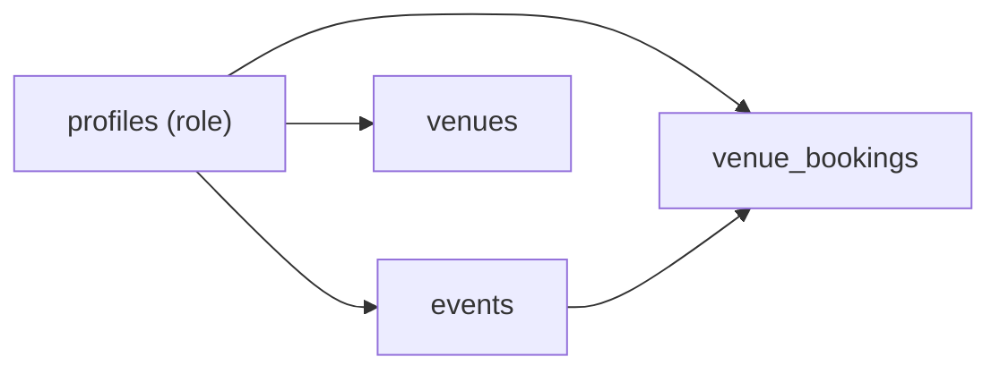

## Venue Management Feature Plan

### 1. Data model and SQL file

- **New SQL file**: `[database/venues.sql](database/venues.sql)` containing all new types, tables, RLS, and grants related to venues.
- **New enum `venue_status`** (or similar): values `active`, `inactive` so we can soft-disable venues without deleting data.
- **New enum `venue_booking_type`**: values like `event`, `maintenance`, `blocked` to distinguish event assignments from general blocks.
- **Table `public.venues`**
  - Columns: `id uuid pk default gen_random_uuid()`, `name text not null unique`, `location text`, `capacity integer` (informational only), `surface_type text` (optional), `status venue_status not null default 'active'`, `open_time time` and `close_time time` (default daily hours), `created_by uuid not null references auth.users(id)`, `created_at timestamptz default now()`, `updated_at timestamptz default now()`.
  - Indexes: btree on `status`, maybe on `name` for search.
  - Trigger: reuse `public.set_updated_at()` for `updated_at` (similar to `events.sql`).
  - RLS:
    - Enable RLS.
    - Policy: all authenticated users (and optionally `anon` if you want public views) can `select` venues.
    - Policy: users with `profiles.role = 'venue_management'` can `insert/update/delete`, with `with check` ensuring `created_by = auth.uid()`.
    - Grants mirroring `events.sql`: `select` to `anon` and `authenticated`, `insert/update/delete` to `authenticated`, `all` to `service_role`.
- **Table `public.venue_bookings`** (core for availability, assignments, and double-booking prevention)
  - Purpose: represent any booking/block for a venue as a time range; event assignments are rows with `booking_type = 'event'` and a non-null `event_id`.
  - Columns: `id uuid pk default gen_random_uuid()`, `venue_id uuid not null references public.venues(id) on delete restrict`, `event_id uuid null references public.events(id) on delete set null`, `booking_type venue_booking_type not null` (`event` requires non-null `event_id` via CHECK), `booking_start timestamptz not null`, `booking_end timestamptz not null`, `notes text`, `created_by uuid not null references auth.users(id)`, `created_at timestamptz default now()`, `updated_at timestamptz default now()`.
  - Constraints:
    - `check (booking_end > booking_start)`.
    - `check (booking_type != 'event' or event_id is not null)`.
    - Optional check aligning with existing `events.event_date`: if you want, enforce `date(booking_start) = e.event_date` at the app layer rather than DB for simplicity.
  - **Double-booking prevention**: use PostgreSQL range types / exclusion constraint:
    - Add `tsrange` or `tstzrange` generated column like `booking_range tsrange generated always as (tsrange(booking_start, booking_end, '[)')) stored`.
    - Exclusion constraint: `exclude using gist (venue_id with =, booking_range with &&)` so overlapping bookings for the same venue are rejected (time-slot level double-booking prevention).
    - Indexes: gist index implicit from exclusion; optional btree index on `(venue_id, booking_start)` for queries.
  - Trigger: `set_updated_at` for `updated_at`.
  - RLS:
    - Enable RLS.
    - Policy: all authenticated users can `select` (similar to events) so schedules are visible.
    - Policy: users with `role in ('venue_management', 'event_management')` can `insert/update/delete` (so event managers can book venues too, if desired), with `with check` enforcing appropriate role and `created_by = auth.uid()`.
    - Grants: parallel to `events.sql` (`select` to `anon` & `authenticated`, `insert/update/delete` to `authenticated`, `all` to `service_role`).
- **Optional small additions** (to consider when implementing, but can be added later):
  - `unique (venue_id, booking_start, booking_end, booking_type)` to prevent duplicate identical rows.
  - Partial index for faster "upcoming bookings for venue" queries.

### 2. How the feature maps to the data model

- **Add venues**
  - Use `venues` table; UI will insert new rows with name, location, capacity, status, open/close times.
  - Only `venue_management` role can modify; others just read.
- **Update availability**
  - Default availability: derived from each venue's `open_time`/`close_time` (used on the frontend to render potential time slots in a day).
  - Specific unavailability/blocks: created as `venue_bookings` rows with `booking_type = 'blocked'` or `maintenance` for a chosen time range; these coexist with (and are enforced by) the same double-booking rules as events.
  - The UI will treat times inside open/close but without any conflicting `venue_bookings` row as "available"; creating a block inserts a row, removing availability deletes that row.
- **Assign venues to events**
  - Event remains the top-level entity in `public.events` (date + metadata), but the actual time-slot/venue assignment is stored in `venue_bookings`.
  - For an event, the UI will:
    - Let the user pick a venue, date, start time, end time.
    - Create a `venue_bookings` row with `booking_type = 'event'`, `event_id = <event.id>`, and `booking_start/booking_end` built from the chosen date and times.
  - To display event schedules, join `events` with `venue_bookings` on `event_id` and filter by date range.
- **Capacity management**
  - `capacity` on `venues` is informational only as per your choice; the backend will not hard-enforce it.
  - UI can:
    - Show capacity next to venue name.
    - Optionally display warnings when an event's expected attendance (if you add such a field later) exceeds capacity.
- **Double-booking prevention**
  - Handled entirely by the `venue_bookings` exclusion constraint.
  - Any attempt (from dashboard or elsewhere) to insert or update a row that overlaps an existing `booking_range` for the same `venue_id` will fail.
  - Frontend will:
    - Catch the unique/exclusion error from Supabase.
    - Display a friendly error indicating that the venue is already booked for that time, prompting the user to pick a different slot or venue.

### 3. Frontend architecture for `/dashboard/venue-management`

- **Server component wrapper** (current `page.tsx`)
  - Keep the auth and role check logic as-is (`role === 'venue_management'`), then render a new client-side component with the necessary data.
  - Optionally fetch initial lists server-side (e.g. all `venues` and maybe upcoming `venue_bookings`) and pass them as props to reduce client round-trips.
- **New client component** (e.g. `VenueManagementPage` or similar under `app/dashboard/venue-management/`)
  - UI built using existing design system (same card, header, table styles as `event-management`):
    - **Section 1: Venues list & form**
      - Table listing all venues with columns: Name, Location, Capacity, Status, Default hours, Actions.
      - Inline actions: edit (status, name, hours), deactivate/activate.
      - Small form to create a new venue (mirroring the event form pattern with a `form action={...}` or client-side mutation if you prefer server actions).
    - **Section 2: Availability & bookings**
      - Tabbed or two-column layout:
        - Left: select venue + date range (e.g. date picker and day view).
        - Right: time-slot view (e.g. 30/60-minute slots between `open_time` and `close_time`) color-coded:
          - Free (no `venue_bookings` row).
          - Booked by event (show event name and sport).
          - Blocked/maintenance.
      - Actions:
        - Click an empty slot range ⇒ create `venue_bookings` row of type `blocked` (for availability control).
        - Click a blocked slot ⇒ confirm and delete the row to reopen availability.
    - **Section 3: Event assignments helper**
      - Panel listing upcoming events (pulling from `events` similarly to `event-management` page, possibly filtered to events without any `venue_bookings` yet).
      - For a selected event:
        - Pick venue + date + start/end times.
        - On submit, create a `venue_bookings` row of type `event`.
      - If Supabase returns a double-booking error, surface it as a clear message.
- **Data fetching & mutations**
  - Use patterns similar to `event-management`:
    - Server actions for `createVenue`, `updateVenue`, `createVenueBooking`, `updateVenueBooking`, `deleteVenueBooking` using Supabase server client.
    - Ensure each action uses `auth.getUser()` and trusts RLS for authorization, while also validating parameters.
  - Consider simple revalidation (Next.js `revalidatePath('/dashboard/venue-management')`) after mutations to keep server and client views in sync.

### 4. RLS and roles alignment

- **Roles**
  - Continue using `profiles.role` enum with `venue_management` for access.
  - Ensure that any policies referencing `venue_management` use the same string literal as existing data (e.g. `p.role = 'venue_management'`).
- **RLS patterns**
  - Mirror `events.sql` style for clarity and maintainability:

- Policies:
  - `venues`: view for all authenticated; manage for `venue_management`.
  - `venue_bookings`: view for all authenticated; manage for `venue_management` and optionally `event_management`.
  - All policies use `auth.uid()` lookups into `profiles` the same way as in `events.sql` for consistency.

### 5. Implementation order

- **Step 1**: Implement `database/venues.sql` with enums, tables, triggers, RLS, and grants. Run in Supabase SQL Editor and verify tables appear.
- **Step 2**: Add basic venue CRUD UI on `/dashboard/venue-management` (list + create + edit + status toggle) using server actions and Supabase queries.
- **Step 3**: Implement `venue_bookings` CRUD operations and simple list of bookings per venue/date (e.g. a table) to confirm schema and RLS work.
- **Step 4**: Enhance the UI into a time-slot view to manage availability visually, relying on `open_time/close_time` and `venue_bookings` data.
- **Step 5**: Add event-assignment flows (select event + venue + time window) and handle double-booking errors gracefully in the UI.
- **Step 6**: Iterate on UX (filters, search, responsive layout) and add any additional derived views (e.g. "today's venue schedule").

